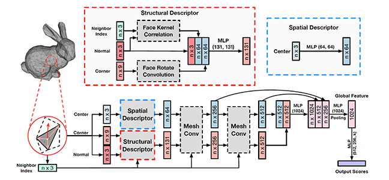

## MeshNet: Mesh Neural Network for 3D Shape Representation
Created by Yutong Feng, Yifan Feng, Haoxuan You, Xibin Zhao, Yue Gao from Tsinghua University.


### Introduction

This work will appear in AAAI 2019. We proposed a novel framework (MeshNet) for 3D shape representation, which could learn on mesh data directly and achieve satisfying performance compared with traditional methods based on mesh and representative methods based on other types of data. You can also check out [paper](http://gaoyue.org/paper/MeshNet.pdf) for a deeper introduction.

Mesh is an important and powerful type of data for 3D shapes. Due to the complexity and irregularity of mesh data, there is little effort on using mesh data for 3D shape representation in recent years. We propose a mesh neural network, named MeshNet, to learn 3D shape representation directly from mesh data. Face-unit and feature splitting are introduced to solve the complexity and irregularity problem. We have applied MeshNet in the applications of 3D shape classification and retrieval. Experimental results and comparisons with the state-of-the-art methods demonstrate that MeshNet can achieve satisfying 3D shape classification and retrieval performance, which indicates the effectiveness of the proposed method on 3D shape representation.

In this repository, we release the code and data for train a Mesh Neural Network for classification and retrieval tasks on ModelNet40 dataset.

### Citation

if you find our work useful in your research, please consider citing:

```
@article{feng2018meshnet,
  title={MeshNet: Mesh Neural Network for 3D Shape Representation},
  author={Feng, Yutong and Feng, Yifan and You, Haoxuan and Zhao, Xibin and Gao, Yue},
  journal={AAAI 2019},
  year={2018}
}
```

### Installation

Install [PyTorch 0.4.0](https://pytorch.org). You also need to install yaml. The code has been tested with Python 3.6, PyTorch 0.4.0 and CUDA 9.0 on Ubuntu 16.04.

### Usage

##### Data Preparation

Firstly, you should download the [reorganized ModelNet40 dataset](https://drive.google.com/open?id=1o9pyskkKMxuomI5BWuLjCG2nSv5iePZz). Then, configure the "data_root" in `config/train_config.yaml` and `config/test_config.yaml` with your path to the downloaded dataset:

```
# config/train_config.yaml and config/test_config.yaml
dataset:
  data_root: [your_path_to_dataset]
```

For each data file `XXX.off` in ModelNet, we reorganize it to the format required by MeshNet and store it into `XXX.npz`. The reorganized file includes two parts of data:

* The "face" part contains the center position, vertices' positions and normal vector of each face.
* The "neighbor_index" part contains the indices of neighbors of each face.

If you wish to create and use your own dataset, simplify your models and organize the `.off` files similar to the ModelNet dataset. 
Then use the code in `data/preprocess.py` to transform them into the required `.npz` format. 
Notice that the parameter `max_faces` in config files should be maximum number of faces among all of your simplified mesh models. 

##### Train Model

To train and evaluate MeshNet for classification and retrieval:

```bash
python train.py
```

You can modify the configuration in the `config/train_config.yaml` for your own training, including the CUDA devices to use, the flag of data augmentation and the hyper-parameters of MeshNet.

##### Test Model

The pretrained MeshNet model weights are stored in [pretrained model](https://drive.google.com/open?id=1l8Ij9BODxcD1goePBskPkBcgKW76Ewcs). You can download it and configure the "load_model" in `config/test_config.yaml` with your path to the weight file.

```
# config/test_config.yaml
load_model: [your_path_to_weight_file]
```

To evaluate the model for classification and retrieval:

```bash
python test.py
```

### Licence

Our code is released under MIT License (see LICENSE file for details).