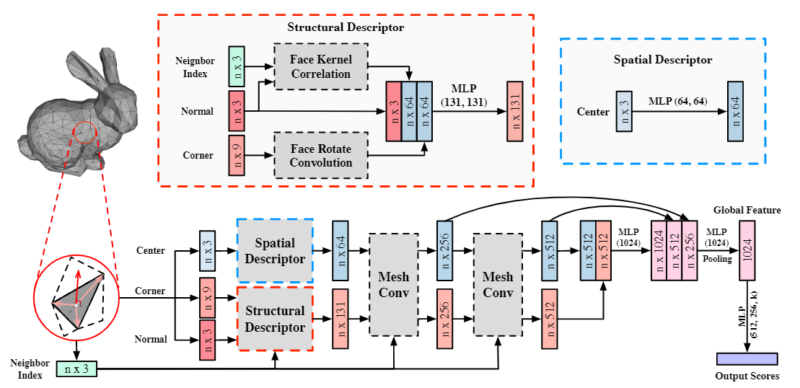

## MeshNet: Mesh Neural Network for 3D Shape Representation
Created by Yutong Feng, Yifan Feng, Haoxuan You, Xibin Zhao, Yue Gao from Tsinghua University.


### Introduction

This work was published in AAAI 2019. We proposed a novel framework (MeshNet) for 3D shape representation, which could learn on mesh data directly and achieve satisfying performance compared with traditional methods based on mesh and representative methods based on other types of data. You can also check out [paper](https://ojs.aaai.org/index.php/AAAI/article/view/4840/4713) for a deeper introduction.

Mesh is an important and powerful type of data for 3D shapes. Due to the complexity and irregularity of mesh data, there is little effort on using mesh data for 3D shape representation in recent years. We propose a mesh neural network, named MeshNet, to learn 3D shape representation directly from mesh data. Face-unit and feature splitting are introduced to solve the complexity and irregularity problem. We have applied MeshNet in the applications of 3D shape classification and retrieval. Experimental results and comparisons with the state-of-the-art methods demonstrate that MeshNet can achieve satisfying 3D shape classification and retrieval performance, which indicates the effectiveness of the proposed method on 3D shape representation.

In this repository, we release the code and data for train a Mesh Neural Network for classification and retrieval tasks on ModelNet40 dataset.

### Update
**[2021/12]** We have released an updated version that the proposed MeshNet achieves 92.75% classification accuracy on ModelNet40. The results are based on a better simplified version of ModelNet40, named "Manifold40", with watertight mesh and 500 faces per model. We also provide a more stable training script to achieve the performance. See the Usage section for details.

### Usage

#### Installation
You could install the required package as follows. This code has been tested with Python 3.8 and CUDA 11.1.
```
pip install -r requirements.txt
```

##### Data Preparation
MeshNet requires the pre-processed ModelNet40 with simplified and re-organized mesh data. To quickly start training, we recommend to use our [pre-processed ModelNet40 dataset](https://cloud.tsinghua.edu.cn/f/77436a9afd294a52b492/?dl=1), and configure the "data_root" in `config/train_config.yaml` and `config/test_config.yaml` with your path to the downloaded dataset. By default, run
```
wget --content-disposition https://cloud.tsinghua.edu.cn/f/77436a9afd294a52b492/?dl=1
mkdir dataset
unzip -d dataset/ ModelNet40_processed.zip 
rm ModelNet40_processed.zip 
```

The details of our pre-processing are as follows: The original dataset are from [ModelNet](http://modelnet.cs.princeton.edu/). Firstly, we simplify the mesh models with no more than `max_faces` faces. We now recommend to use the [Manifold40](https://cloud.tsinghua.edu.cn/f/2a292c598af94265a0b8/?dl=1) version with watertight mesh and `max_faces=500`. Then we reorganize the dataset to the format required by MeshNet and store it into `XXX.npz`. The reorganized file includes two parts of data:
- The "faces" part contains the center position, vertices' positions and normal vector of each face.
- The "neighbors" part contains the indices of neighbors of each face.

If you wish to create and use your own dataset, simplify your models into `.obj` format and use the code in `data/preprocess.py` to transform them into the required `.npz` format. Notice that the parameter `max_faces` in config files should be maximum number of faces among all of your simplified mesh models. 

##### Evaluation
The pretrained MeshNet model weights are stored in [pretrained model](https://cloud.tsinghua.edu.cn/f/33bfdc6f103340daa86a/?dl=1). You can download it and configure the "load_model" in `config/test_config.yaml` with your path to the weight file. Then run the test script.
```
wget --content-disposition https://cloud.tsinghua.edu.cn/f/33bfdc6f103340daa86a/?dl=1
python test.py
```

##### Training

To train and evaluate MeshNet for classification and retrieval:

```bash
python train.py
```

You can modify the configuration in the `config/train_config.yaml` for your own training, including the CUDA devices to use, the flag of data augmentation and the hyper-parameters of MeshNet.


### Citation

if you find our work useful in your research, please consider citing:

```
@inproceedings{feng2019meshnet,
  title={Meshnet: Mesh neural network for 3d shape representation},
  author={Feng, Yutong and Feng, Yifan and You, Haoxuan and Zhao, Xibin and Gao, Yue},
  booktitle={Proceedings of the AAAI Conference on Artificial Intelligence},
  volume={33},
  number={01},
  pages={8279--8286},
  year={2019}
}
```

### Licence

Our code is released under MIT License (see LICENSE file for details).
